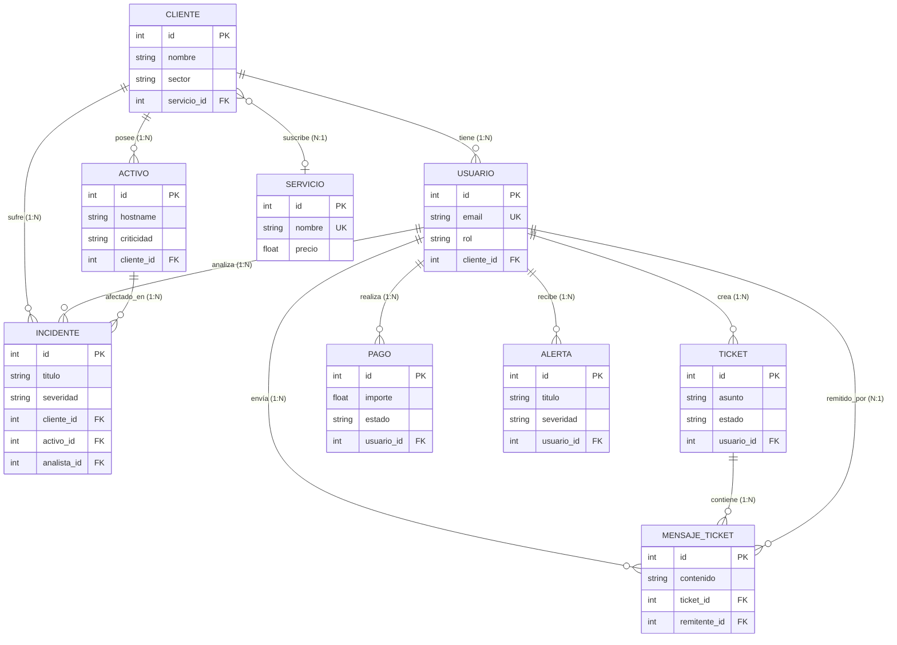

# 📊 Diagrama Entidad-Relación (E/R) Profesional
### Ecosistema de Base de Datos - Sofia Solutions SOC

Este documento contiene la representación formal de la base de datos relacional de **Sofia Solutions** (implementada en PostgreSQL 15 y modelada con Prisma ORM). Está diseñado siguiendo los estándares de excelencia requeridos por los tribunales de TFG académicos, incluyendo las claves primarias (PK), foráneas (FK), tipos de datos, enumeraciones (Enums) y cardinalidad precisa.

---

## 🎨 1. Diagrama E/R en Tiempo Real (Mermaid.js)

> [!TIP]
> Puedes renderizar este código directamente en GitHub, VS Code (con la extensión de Markdown Preview Mermaid) o en cualquier editor Mermaid en línea.

---

## 📋 2. Diccionario de Datos y Especificación de Entidades

A continuación se detallan las enumeraciones, tablas clave y su lógica de negocio asociada para la defensa ante el tribunal:

### 2.1 Enumeraciones de Control (Security Enums)
El backend utiliza tipos fuertemente tipados para garantizar la integridad y la consistencia en el reporte de métricas del SOC:
*   **`Role`**: `ADMIN` (Analista del SOC), `CLIENT` (Cliente Corporativo Iberdrola, MAPFRE, etc.).
*   **`AssetCriticality`**: `BAJA`, `MEDIA`, `ALTA`, `CRÍTICA`.
*   **`IncidentSeverity`**: `BAJA`, `MEDIA`, `ALTA`, `CRÍTICA`, `URGENTE` *(Clave para la automatización SOS/n8n)*.
*   **`IncidentStatus`**: `TRIAGE`, `INVESTIGATING` (Investigando), `CONTAINED` (Mitigado/Contenido), `RESOLVED` (Resuelto).

---

### 2.2 Descripción Técnica de las Entidades Principales

#### 👥 1. Modelo `User` (Gestión de Identidad e IAM)
Representa a todos los actores del sistema. Permite un aislamiento multi-inquilino (*multi-tenant*):
*   Si el rol es `CLIENT`, se vincula de forma obligatoria a un `CustomerId` para garantizar que un cliente **únicamente pueda visualizar la telemetría e incidentes de su propia compañía** (Aislamiento de Datos por Diseño).
*   Si el rol es `ADMIN`, actúa como analista global del SOC y puede ser asignado a la investigación de incidentes (`Incident.analystId`).

#### 🏢 2. Modelo `Customer` (Compañías Clientes)
Entidad central que modela a los clientes del SOC (ej. Iberdrola S.A.). Centraliza todos los activos (`Asset`), incidentes de ciberseguridad (`Incident`) y la suscripción al servicio principal de seguridad del SOC (`primaryServiceId`).

#### 💻 3. Modelo `Asset` (Inventario de Activos y Superficie de Ataque)
Modelado de los servidores y dispositivos del cliente expuestos a internet (ej. Servidor Web Iberdrola). Registra la criticidad y el **`exposureScore`** (índice numérico de exposición al riesgo que alimenta las gráficas visuales del WAF y Grafana).

#### 🚨 4. Modelo `Incident` (Registro e Historial Ofensivo)
Corazón de la telemetría SOC. Registra cada vector de ataque simulado (SQLi, Brute Force, DoS, XSS), asociándolo a la IP de origen, el país geolocalizado en tiempo real (`sourceCountry`), el activo objetivo (`Asset`) y el analista asignado (`User`).

#### 🛡️ 5. Modelo `SecurityEvent` (Bitácora de Eventos de Seguridad)
Tabla independiente de alto rendimiento que actúa como el **SIEM del SOC**. Registra el tráfico sospechoso detectado por el middleware WAF (peticiones SQL inyectadas, bloqueos por Rate Limit, payloads XSS) para auditoría forense posterior.

---

## 🧠 3. Justificación de Diseño para el Tribunal
Si el tribunal te pregunta por el diseño de la base de datos, puedes responder con estos 3 pilares de ingeniería:

1.  **Aislamiento Estricto (Multi-Tenant):** *"Vinculamos la tabla `User` con la tabla `Customer` para asegurar por backend que ningún cliente pueda realizar ataques de IDOR o visualizar datos de otras compañías. Todo el acceso a la base de datos se filtra a nivel de sesión por el ID del cliente."*
2.  **Integridad de Datos en Ciberseguridad (Enums):** *"Definimos tipos de datos enumerados específicos como `IncidentSeverity` e `IncidentStatus`. Esto garantiza que los filtros en Grafana sean deterministas y que no haya errores de traducción ni inconsistencias ortográficas al registrar ataques."*
3.  **Desacoplamiento Forense (SecurityEvent vs Incident):** *"La tabla `SecurityEvent` funciona como un log crudo (SIEM) donde se registran peticiones a nivel de red analizadas por el WAF. Cuando una de estas peticiones se confirma como intrusión activa de alta severidad, se promueve formalmente a la tabla `Incident` con un analista SOC asignado para su contención."*
