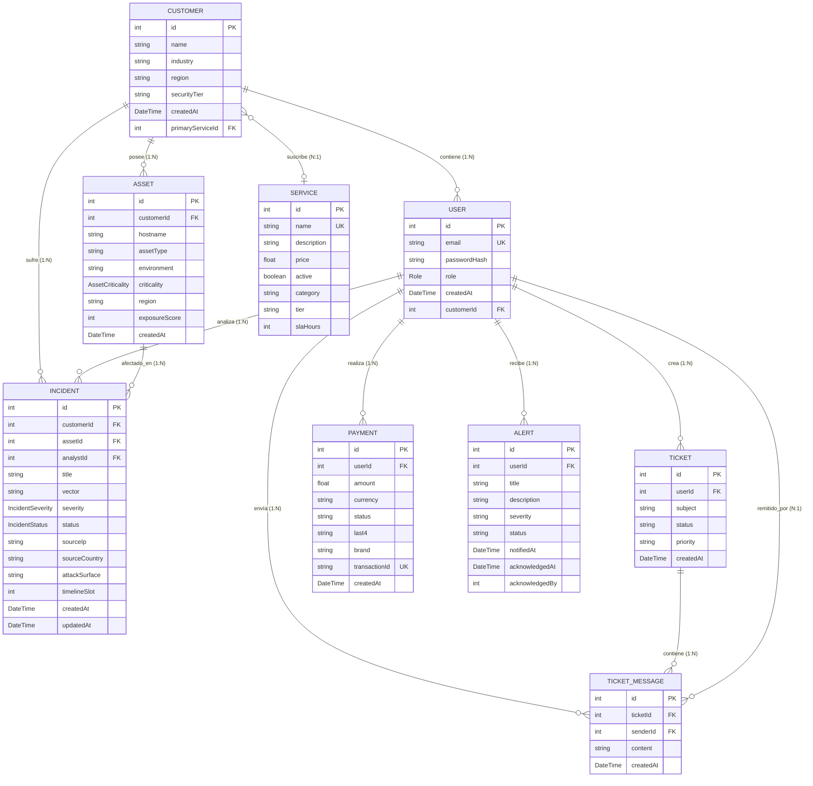

# 🛡️ Sofia Solutions - Security & SOC Monitoring

Proyecto final orientado a **ASIX / Ciberseguridad**, centrado en la demostración de arquitecturas de seguridad ofensiva y monitorización defensiva (SOC).

---

## 🌐 Puntos de Acceso (Producción / Defensa)

| Módulo | Acceso Público | Puerto Local |
|--------|----------------|--------------|
| **Plataforma Corporativa** | [Acceder](https://sofia-solutions.serveousercontent.com) | `8000` |
| **Consola de Auditoría** | [Acceder](https://sofia-solutions.serveousercontent.com/consola) | `/consola` |
| **Panel SOC (Admin)** | [Acceder](https://sofia-solutions.serveousercontent.com/admin) | `/admin` |
| **Métricas Técnicas (Grafana)** | [Acceder](https://sofia-solutions.serveousercontent.com/grafana/) | `3000` |
| **Webhooks (n8n)** | [Acceder](https://sofia-n8n.serveousercontent.com) | `5678` |

---

## 🔐 Credenciales Maestras (Simplified)

Para facilitar la demostración ante el tribunal, se han unificado todas las contraseñas:

| Rol | Usuario (Email) | Contraseña |
|-----|-----------------|------------|
| **Administrador SOC** | `admin@sofia.local` | `admin123` |
| **Cliente Corporativo** | `iberdrola@sofia.local` | `iberdrola123` |
| **Auditor / Hacking** | (No requiere cuenta - Inyección SQL) | `N/A` |

---

## 🚀 Guía de Despliegue en Codespaces

Sofia Solutions está optimizado para ejecutarse en la nube de GitHub en segundos:

1. Haz clic en el botón **"Open in Codespaces"** arriba.
2. Espera a que Docker termine de levantar los 7 contenedores (aprox. 1-2 min).
3. Aparecerá un aviso de puertos abiertos. **Asegúrate de poner todos los puertos en "Public"** (Click derecho sobre el puerto -> Port Visibility -> Public).
4. El sistema autogenerará el túnel de seguridad y podrás acceder a las URLs del README.

---

## ⚡ Guía para la Defensa (Demostración en vivo)

### 1. Fase Ofensiva (Modo Vulnerable)
1. Activa el **Modo Vulnerable** con el script `scripts/ACTIVAR-MODO-VULNERABLE.bat` (o `.sh` en Linux).
2. Ve a la **Consola de Auditoría** y lanza un ataque **SQL Injection** en el login.
3. Observa cómo el sistema permite entrar sin contraseña.
4. Lanza un ataque **XSS de Robo de Cookies**. Se abrirá un simulador de **Burp Suite**. Modifica el rol a `ADMIN` para demostrar la **Escalada de Privilegios**.

### 2. Fase Defensiva (Modo Seguro)
1. Activa el **Modo Seguro** con `scripts/ACTIVAR-MODO-SEGURO.bat`: Reactiva todas las capas de protección (Bcrypt, WAF, JWT stricts). Úsalo para demostrar la eficacia de las soluciones de Sofia Solutions frente a los mismos ataques realizados anteriormente.
2. Repite los ataques anteriores. El **WAF Shield** bloqueará las inyecciones y el **Rate Limiting** cortará la conexión tras 3 intentos.
3. Explica el uso de **Bcrypt (12 rondas)** y la validación estricta de **Tokens JWT**.

### 3. Monitorización SOC y Enriquecimiento de Telemetría
1. **Rastreo Geográfico**: El panel `/admin` ahora visualiza la **IP de origen** y el **País (Zona)** de los atacantes en tiempo real dentro del feed de incidentes.
2. **Alertas Inteligentes (n8n)**: Cada intrusión crítica activa un flujo de n8n que envía un correo al SOC enriquecido con los metadatos geográficos del atacante.
3. **Validación de Identidad**: Muestra el uso de **Bcrypt (12 rondas)** y la monitorización de sesiones activas.

### 4. Post-Explotación: Consola de Auditoría y Sofia Kit Auditor
- **Consola de Auditoría (`/consola`)**: Interfaz web interactiva ofensiva del proyecto. Desde aquí se lanzan los ataques en vivo de SQL Injection (exfiltra credenciales e IBANs/CVVs de base de datos), XSS con simulador Burp Suite integrado, e inundación DoS (simulando caída y restauración de servicio perimetral reactiva en tiempo real).
- **Sofia Kit Auditor (`scripts/sofia-audit-framework.py`)**: Herramienta CLI complementaria de post-explotación en Python. Permite:
  * **Persistencia**: Mantener el acceso al sistema de forma silenciosa tras el compromiso inicial.
  * **Exfiltración**: Automatizar la descarga de datos sensibles a la terminal de comandos.
  * **Auditoría Silenciosa**: Ejecutar peticiones en el backend sin disparar alertas de primer nivel.
  * **Lanzador**: Ejecutable rápido con `scripts/lanzar-rootkit.bat`.

---

## 🛡️ Arquitectura de Seguridad
Sofia Solutions implementa una defensa en profundidad:
- **Perímetro:** WAF Rules y Rate Limiting.
- **Lógica:** Validación de Schemas y Sanitización.
- **SOC:** Telemetría enriquecida con **IP/Geo** y respuesta ante incidentes automatizada.

---

## 📊 Modelo de Datos (Diagrama E/R)

Este diagrama interactivo representa la estructura relacional de la base de datos de Sofia Solutions (PostgreSQL + Prisma ORM) y la lógica multi-inquilino de las tablas del SOC:

---

## 🏗️ Stack Tecnológico
- **Frontend:** PHP 8.2 + Apache (Proxy Inverso).
- **Backend:** Node.js v20 + Express + Prisma ORM.
- **Base de Datos:** PostgreSQL 15.
- **Observabilidad:** Prometheus + Grafana + cAdvisor.
- **Automatización:** n8n Workflow Automation.
- **Túnel de Red:** Serveo SSL Tunneling.

---
© 2026 Sofia Solutions - Security Framework para Defensa TFG
