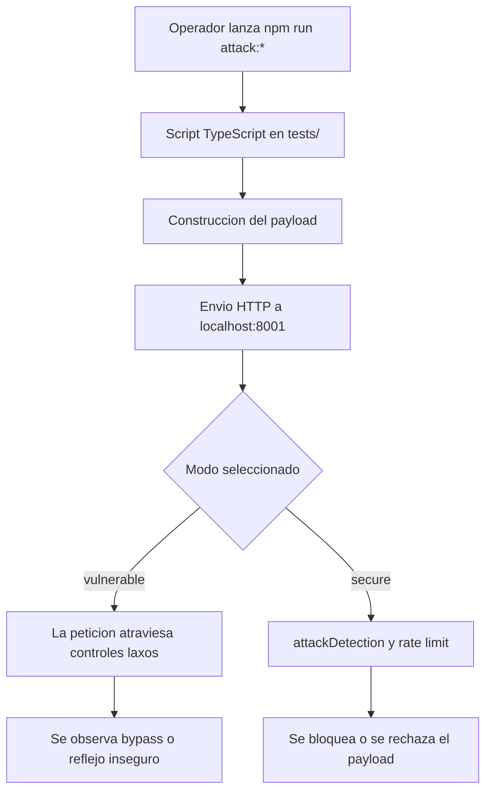
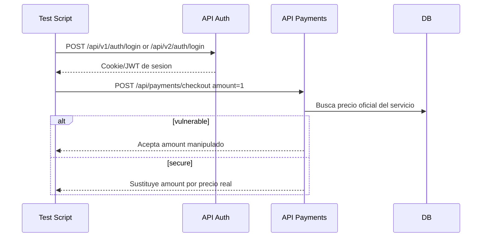

# Guia de scripts de ataque

## Objetivo

Este documento explica como ejecutar los scripts de demostracion sobre los flujos de login vulnerable y login seguro de Sofia Solutions.

## Flujo general de pruebas



Los endpoints principales son:

- `POST /api/v1/auth/login`
- `POST /api/v2/auth/login`

## Requisitos previos

1. Levantar backend en `http://localhost:8001`
2. Tener PostgreSQL operativo
3. Haber ejecutado seed para disponer de usuarios de prueba

Credenciales por defecto:

- `admin@sofia.local`
- `SofiaAdmin2026!`

## Scripts disponibles

### SQL injection

- `npm run attack:sqli:vuln`
  Envia un payload tipo `' OR 1=1 --` al login vulnerable. En esta demo local provoca un bypass intencional y el backend devuelve `200`.

- `npm run attack:sqli:secure`
  Envia el mismo payload al login seguro. Debe recibir `403` por el middleware de deteccion de ataques.

Payload utilizado:

```json
{
  "email": "admin@sofia.local' OR 1=1 --",
  "password": "demo123"
}
```

Interpretacion:

- en vulnerable: se activa la rama de bypass academico y el backend autentica al primer admin disponible
- en secure: el request se corta antes de llegar a la verificacion de credenciales

### XSS

- `npm run attack:xss:vuln`
  Envia un payload con `<script>` al login vulnerable. La respuesta incluye un campo reflejado para demostracion academica.

- `npm run attack:xss:secure`
  Envia el mismo payload al login seguro. Debe recibir `403`.

Payload utilizado:

```json
{
  "email": "<script>alert('xss')</script>@sofia.local",
  "password": "SofiaAdmin2026!"
}
```

Interpretacion:

- en vulnerable: la API devuelve `messageHtml` y la interfaz de demo lo inserta a proposito para mostrar el riesgo
- en secure: el middleware detecta el patron XSS y bloquea

### Path traversal

- `npm run attack:traversal:vuln`
  Prueba un payload `../../etc/passwd` sobre una ruta del catalogo. En modo vulnerable el request no se bloquea.

- `npm run attack:traversal:secure`
  Ejecuta el mismo payload en modo seguro. Debe bloquearse con `403`.

Payload base:

```text
../../etc/passwd
```

### Manipulacion de pagos

- `npm run attack:payment:vuln`
  Inicia sesion en login vulnerable y envia un checkout con `amount=1`. La API vulnerable guarda ese valor manipulado.

- `npm run attack:payment:secure`
  Inicia sesion en login seguro y envia el mismo payload. El backend ignora el importe del cliente y toma el precio real desde base de datos.

Flujo especifico:



## Ejecucion agrupada

- `npm run attack:all:vuln`
- `npm run attack:all:secure`

Estos comandos encadenan todos los scripts de la bateria.

## Lectura de resultados

- `200` en vulnerable:
  El backend ha permitido el flujo inseguro o la vulnerabilidad simulada.

- `403` en secure:
  El middleware ha detectado el patron y ha bloqueado la peticion antes de llegar a la logica sensible.

- `401`:
  La peticion llego al backend pero no supero autenticacion.

## Orden recomendado para la demostracion

1. Ejecutar `npm run attack:sqli:vuln`
2. Ejecutar `npm run attack:sqli:secure`
3. Repetir con XSS
4. Mostrar `npm run attack:payment:vuln`
5. Mostrar `npm run attack:payment:secure`
6. Abrir `http://localhost:8000/login/vulnerable`
7. Abrir `http://localhost:8000/login-secure`

## Relacion con ficheros de codigo

- Scripts: [tests/](C:/Users/sgomez/Desktop/sofia-solutions/sofia-backend/tests)
- Rutas auth: [auth.routes.ts](C:/Users/sgomez/Desktop/sofia-solutions/sofia-backend/src/routes/auth.routes.ts)
- Controlador auth: [auth.controller.ts](C:/Users/sgomez/Desktop/sofia-solutions/sofia-backend/src/controllers/auth.controller.ts)
- Deteccion de ataques: [attackDetection.ts](C:/Users/sgomez/Desktop/sofia-solutions/sofia-backend/src/middleware/attackDetection.ts)

## Relacion con la interfaz web

La web expone una pantalla propia en:

- `http://localhost:8000/login`
- `http://localhost:8000/login-secure`
- `http://localhost:8000/login/vulnerable`

Desde esa interfaz tambien se pueden precargar payloads SQLi y XSS para observar la diferencia entre ambos flujos.


