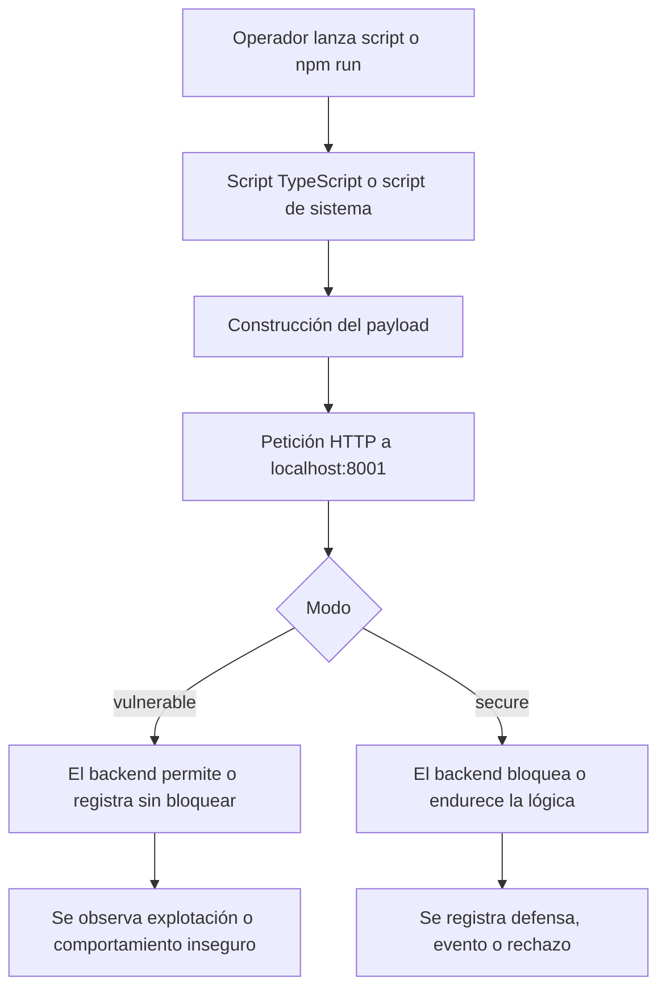

# Guía de ataques y validación

## Objetivo

Este documento explica cómo se utilizan los scripts de ataque incluidos en el proyecto para demostrar:

- qué debilidades existen en la versión vulnerable;
- qué mecanismos las bloquean en la versión segura;
- cómo se relacionan esos ataques con los servicios ofrecidos por Sofia Solutions.

No se trata de un laboratorio ofensivo genérico. Cada ataque se usa como evidencia técnica dentro de un proyecto académico de ASIX.

## Requisitos previos

Antes de ejecutar la batería de pruebas debe estar operativo:

- frontend corporativo en `http://localhost:8000`;
- backend en `http://localhost:8001`;
- PostgreSQL funcionando;
- seed aplicada para disponer de usuarios, clientes, activos, incidentes y servicios.

Credenciales de prueba:

- `admin@sofia.local`
- `SofiaAdmin2026!`

## Flujo general de los scripts



## Ejecución rápida

### Desde Windows

```powershell
powershell -ExecutionPolicy Bypass -File scripts/run-attacks.ps1 -Mode vulnerable
powershell -ExecutionPolicy Bypass -File scripts/run-attacks.ps1 -Mode secure
```

### Desde Linux

```bash
sh ./scripts/run-attacks.sh vulnerable
sh ./scripts/run-attacks.sh secure
```

### Desde npm

- `npm run attack:sqli:vuln`
- `npm run attack:sqli:secure`
- `npm run attack:xss:vuln`
- `npm run attack:xss:secure`
- `npm run attack:traversal:vuln`
- `npm run attack:traversal:secure`
- `npm run attack:payment:vuln`
- `npm run attack:payment:secure`
- `npm run attack:bruteforce:vuln`
- `npm run attack:bruteforce:secure`
- `npm run attack:defense:vuln`
- `npm run attack:defense:secure`
- `npm run services:validate`
- `npm run services:matrix:vuln`
- `npm run services:matrix:secure`

## Ataques incluidos

## 1. SQL Injection

### Objetivo

Demostrar que la versión vulnerable permite un bypass académico controlado y que la versión segura lo bloquea antes de llegar a la lógica sensible.

### Endpoint

- vulnerable: `POST /api/v1/auth/login`
- seguro: `POST /api/v2/auth/login`

### Payload de ejemplo

```json
{
  "email": "admin@sofia.local' OR 1=1 --",
  "password": "demo123"
}
```

### Resultado esperado

- vulnerable: `200` o autenticación forzada de demostración;
- seguro: `403`.

### Servicio relacionado

- `Pentesting Premium`

Este servicio se justifica porque permite detectar y reducir este tipo de debilidades antes de producción.

## 2. XSS

### Objetivo

Mostrar el riesgo de reflejar contenido malicioso en la versión vulnerable y el bloqueo preventivo en la versión segura.

### Endpoint

- vulnerable: `POST /api/v1/auth/login`
- seguro: `POST /api/v2/auth/login`

### Payload de ejemplo

```json
{
  "email": "<script>alert('xss')</script>@sofia.local",
  "password": "SofiaAdmin2026!"
}
```

### Resultado esperado

- vulnerable: el payload puede reflejarse en una respuesta de demostración;
- seguro: `403`.

### Servicio relacionado

- `Pentesting Premium`

## 3. Path Traversal

### Objetivo

Comprobar que las cadenas típicas de traversal son toleradas en el modo vulnerable y bloqueadas en el seguro.

### Payload de ejemplo

```text
../../etc/passwd
```

### Resultado esperado

- vulnerable: la petición no se bloquea de forma preventiva;
- seguro: `403`.

### Servicios relacionados

- `Cloud Security Hardening`
- `Pentesting Premium`

## 4. Fuerza bruta

### Objetivo

Comprobar la diferencia entre un login sin limitación efectiva y otro protegido con restricciones de intentos.

### Endpoint

- vulnerable: `POST /api/v1/auth/login`
- seguro: `POST /api/v2/auth/login`

### Resultado esperado

- vulnerable: permite múltiples intentos seguidos;
- seguro: responde con error o bloqueo tras superar el umbral.

### Servicios relacionados

- `SOC 24/7`
- `IR Retainer`

## 5. Manipulación de pagos

### Objetivo

Demostrar por qué nunca debe confiarse el precio final al cliente.

### Flujo

1. Se inicia sesión.
2. Se envía una petición de checkout con `amount` manipulado.
3. El backend vulnerable puede aceptar ese valor.
4. El backend seguro recalcula el importe desde base de datos.

### Resultado esperado

- vulnerable: acepta un importe modificado por el cliente;
- seguro: ignora el importe del cliente y aplica el precio oficial.

### Servicio relacionado

- `Cloud Security Hardening`

## Matriz resumida

| Ataque | Script | Modo vulnerable | Modo seguro | Servicio relacionado |
|---|---|---|---|---|
| SQL Injection | `attack:sqli:*` | bypass o respuesta insegura | bloqueo `403` | Pentesting Premium |
| XSS | `attack:xss:*` | reflexión controlada | bloqueo `403` | Pentesting Premium |
| Path Traversal | `attack:traversal:*` | tolerado | bloqueo `403` | Cloud Security Hardening |
| Fuerza bruta | `attack:bruteforce:*` | sin límite efectivo | limitación o bloqueo | SOC 24/7 |
| Manipulación de pagos | `attack:payment:*` | amount alterado | amount validado en servidor | Cloud Security Hardening |

## Relación con el SOC y Grafana

La batería de ataques no solo sirve para enseñar explotación. También permite demostrar:

- que el SOC corporativo muestra actividad e incidentes coherentes;
- que Grafana puede visualizar la actividad técnica y las métricas internas;
- que la versión segura genera trazabilidad y evidencias más útiles.

## Qué mostrar en una defensa

Secuencia recomendada:

1. Arrancar el entorno con Docker.
2. Enseñar login vulnerable y seguro.
3. Ejecutar un ataque SQLi o XSS.
4. Comparar respuesta HTTP.
5. Abrir el SOC en `http://localhost:8000/admin/security-monitor`.
6. Abrir Grafana en `http://localhost:3000`.
7. Explicar qué servicio protege frente a ese vector.
