# Memoria tecnica en formato APA

## Portada

**Titulo del proyecto:**  
Diseno e implementacion de una plataforma web full stack para demostracion academica de ciberseguridad ofensiva y defensiva en Sofia Solutions

**Ciclo formativo:**  
Administracion de Sistemas Informaticos en Red (ASIR)

**Autor:**  
[Nombre del alumno]

**Centro educativo:**  
[Nombre del centro]

**Curso academico:**  
2025-2026

**Tutor academico:**  
[Nombre del tutor]

**Fecha de entrega:**  
[Fecha]

## Resumen

La presente memoria describe el diseno y desarrollo de *Sofia Solutions*, una plataforma web full stack orientada a fines academicos dentro del ciclo de Administracion de Sistemas Informaticos en Red (ASIR). La solucion simula la actividad de una empresa ficticia especializada en servicios IT y ciberseguridad, integrando una web corporativa, un panel principal de operacion y una API REST con persistencia de datos, autenticacion y mecanismos de observabilidad.

La caracteristica diferencial del proyecto consiste en la coexistencia de dos modos operativos: `vulnerable` y `secure`. Ambos comparten la misma base funcional, pero difieren en la forma de tratar autenticacion, sesiones, pagos, validacion de entradas y deteccion de ataques. Esta aproximacion permite demostrar de forma practica el impacto de las malas practicas de seguridad y compararlas con implementaciones endurecidas basadas en controles modernos.

Desde el punto de vista tecnico, el frontend se implementa con React y TypeScript, mientras que el backend se desarrolla con Express, TypeScript, Prisma y PostgreSQL. Se incorporan metricas compatibles con Prometheus, logging estructurado con Winston, documentacion OpenAPI y despliegue opcional mediante Docker Compose. El resultado es un entorno adecuado tanto para defensa oral como para aprendizaje practico de conceptos relacionados con administracion de sistemas, desarrollo de APIs y seguridad aplicada.

**Palabras clave:** ASIR, ciberseguridad, React, Express, Prisma, PostgreSQL, JWT, Docker, observabilidad.

## Abstract

This report describes the design and development of *Sofia Solutions*, a full stack web platform created for academic purposes within the ASIR vocational program. The solution simulates the activity of a fictional IT and cybersecurity company and integrates a corporate website, an operational dashboard, and a REST API with persistence, authentication, and observability mechanisms.

The most distinctive aspect of the project is the coexistence of two operational modes: `vulnerable` and `secure`. Both share the same functional base, but differ in how they handle authentication, sessions, payments, input validation, and attack detection. This approach enables practical demonstration of insecure practices and direct comparison with hardened implementations based on modern security controls.

From a technical perspective, the frontend is implemented using React and TypeScript, while the backend is built with Express, TypeScript, Prisma, and PostgreSQL. Prometheus-compatible metrics, Winston structured logging, OpenAPI documentation, and optional Docker Compose deployment are included. The result is a platform suitable for oral defense, technical documentation, and hands-on learning in systems administration, API development, and applied cybersecurity.

## Indice

1. Introduccion  
2. Justificacion del proyecto  
3. Objetivos  
4. Alcance y limitaciones  
5. Metodologia y plan de trabajo  
6. Arquitectura general  
7. Analisis funcional  
8. Desarrollo del frontend  
9. Desarrollo del backend  
10. Seguridad comparativa: modo vulnerable y modo seguro  
11. Flujo de datos, flujo de codigo y observabilidad  
12. Base de datos y modelo relacional  
13. Despliegue, contenedorizacion y puertos  
14. Pruebas realizadas  
15. Planificacion temporal y recursos  
16. Presupuesto estimado  
17. Resultados, conclusiones y trabajo futuro  
18. Referencias  
19. Anexos  

## 1. Introduccion

La realidad actual de los servicios digitales exige que un administrador de sistemas no solo conozca infraestructuras, redes y sistemas operativos, sino tambien conceptos de desarrollo seguro, exposicion de APIs, registro de eventos, monitorizacion y gestion de incidentes. En entornos empresariales, la linea que separa la administracion de sistemas del desarrollo backend es cada vez mas difusa, especialmente en escenarios cloud, DevOps y plataformas internas.

Partiendo de esa premisa, este proyecto busca construir una aplicacion didactica que no se limite a ser funcional, sino que permita estudiar el efecto de distintas decisiones de seguridad sobre un mismo sistema. En lugar de desarrollar una plataforma puramente empresarial, se ha optado por una plataforma comparativa. El backend puede ejecutarse en modo vulnerable o en modo seguro, mostrando con claridad que controles faltan, que riesgos aparecen y como se corrigen.

## 2. Justificacion del proyecto

La eleccion del proyecto se justifica por tres motivos principales:

1. **Relevancia tecnica.**  
   Las APIs REST, la autenticacion con tokens, la observabilidad y la proteccion ante ataques forman parte del dia a dia de cualquier infraestructura moderna.

2. **Valor academico.**  
   La existencia de dos modos de seguridad convierte la aplicacion en un laboratorio controlado donde se puede demostrar teoria con resultados visibles.

3. **Relacion con ASIR.**  
   El proyecto integra competencias de administracion de sistemas, bases de datos, redes, despliegue, seguridad, monitorizacion y documentacion.

## 3. Objetivos

### 3.1 Objetivo general

Desarrollar una plataforma full stack orientada a la demostracion academica de ciberseguridad aplicada, capaz de mostrar diferencias reales entre una implementacion API vulnerable y otra segura.

### 3.2 Objetivos especificos

1. Crear un frontend moderno, editable y desacoplado.
2. Desarrollar un backend modular en Express y TypeScript.
3. Implementar un modelo de datos en Prisma sobre PostgreSQL.
4. Integrar autenticacion, pagos, tickets y panel administrativo.
5. Incorporar metricas, logs y trazabilidad de eventos de seguridad.
6. Permitir conmutar entre `APP_MODE=vulnerable` y `APP_MODE=secure`.
7. Documentar la solucion con suficiente profundidad para memoria y defensa.

## 4. Alcance y limitaciones

### 4.1 Alcance

El proyecto cubre:

- landing corporativa editable
- panel principal 2026
- API REST con rutas de autenticacion, servicios, pagos, tickets y administracion
- deteccion de patrones SQLi, XSS y path traversal
- metricas Prometheus
- logging estructurado
- documentacion Swagger
- despliegue local y mediante Docker Compose

### 4.2 Limitaciones

- los pagos son simulados, no se integran con Stripe real
- no se almacenan tarjetas reales
- el sistema no esta pensado para produccion
- las pruebas de seguridad incluidas son demostrativas, no sustituyen a una auditoria profesional

## 5. Metodologia y plan de trabajo

La metodologia seguida ha sido incremental y basada en iteraciones:

1. Definicion de requisitos.
2. Modelado de entidades y flujos.
3. Implementacion del backend base.
4. Integracion de seguridad dual.
5. Construccion del frontend editable.
6. Integracion de observabilidad.
7. Preparacion de Docker y documentacion.

### 5.1 Diagrama del ciclo de trabajo

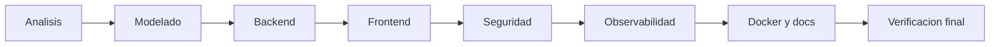

## 6. Arquitectura general

El sistema adopta una arquitectura cliente-servidor desacoplada:

- el frontend representa la interfaz de usuario y consume la API
- el backend expone servicios REST, aplica reglas de negocio y accede a la base de datos
- PostgreSQL persiste la informacion
- Prometheus recoge metricas

### 6.1 Arquitectura de alto nivel

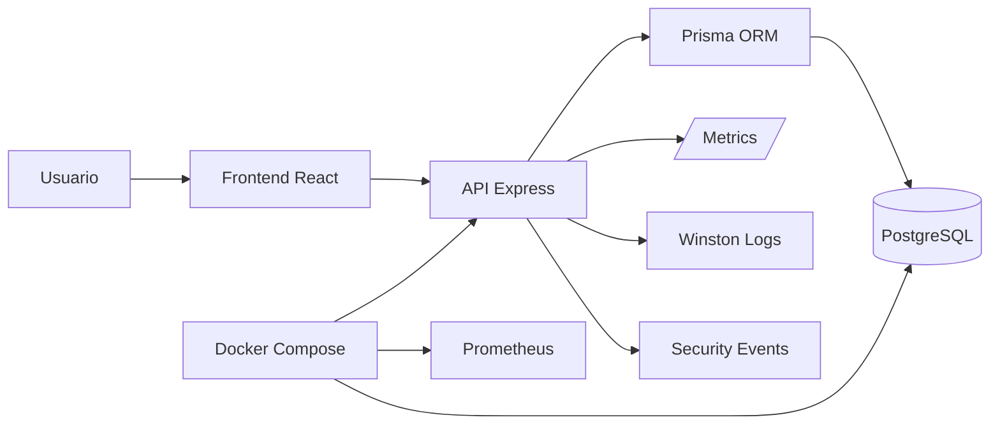

### 6.2 Arquitectura interna del backend

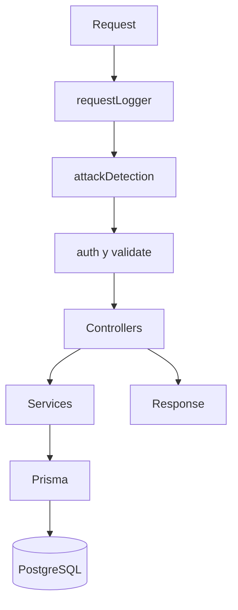

## 7. Analisis funcional

### 7.1 Modulos funcionales

1. **Autenticacion**
2. **Catalogo de servicios**
3. **Pagos**
4. **Tickets**
5. **Administracion**
6. **Seguridad y monitorizacion**

### 7.2 Casos de uso principales

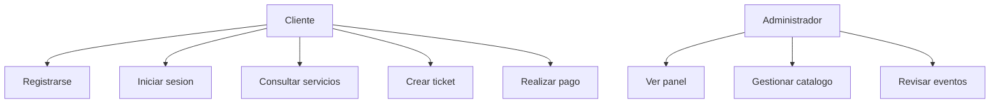

## 8. Desarrollo del frontend

### 8.1 Objetivo del frontend

El frontend se ha disenado para ofrecer dos experiencias complementarias:

- una pagina corporativa moderna y editable
- un panel operativo que centraliza datos de negocio y seguridad

### 8.2 Tecnologias utilizadas

- React 19
- TypeScript
- React Router
- Vite
- CSS modular propio

### 8.3 Rutas implementadas

- `/` para la landing
- `/dashboard` para el panel principal

### 8.4 Flujo de datos del frontend

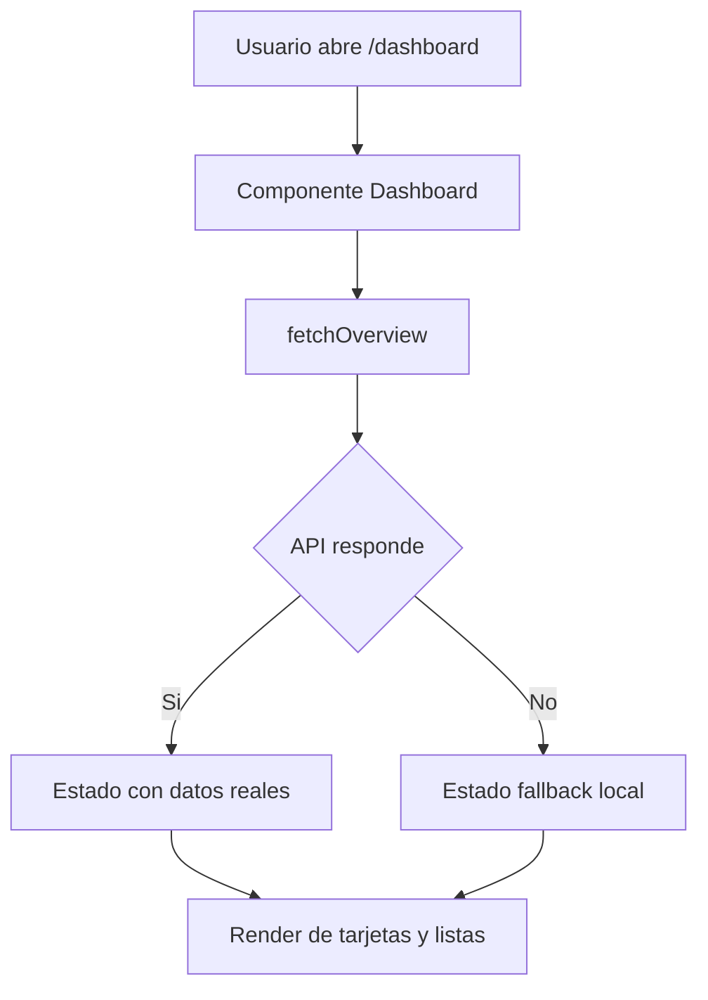

### 8.5 Flujo de codigo del frontend

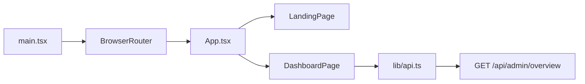

### 8.6 Decisiones visuales

Se ha optado por una interfaz con:

- tipografia Poppins + Inter
- fondos con gradientes y capas translúcidas
- tarjetas para modularidad visual
- logo SVG sin fondo blanco
- panel principal con enfasis en 2026

## 9. Desarrollo del backend

### 9.1 Organizacion del codigo

El backend se ha separado en carpetas para mejorar mantenibilidad:

- `config/`
- `controllers/`
- `routes/`
- `middleware/`
- `services/`
- `utils/`
- `docs/`

### 9.2 Flujo general de ejecucion del backend

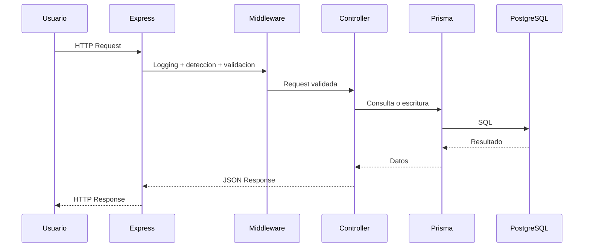

### 9.3 Autenticacion

El backend utiliza JWT para acceso y refresh. En modo seguro se endurecen las cookies y el hashing. En modo vulnerable se mantienen decisiones inseguras para comparacion.

### 9.4 Pagos

El modulo de pagos no procesa tarjetas reales. Se simula una transaccion para centrarse en el control del `amount`, trazabilidad y persistencia.

### 9.5 Tickets

El sistema de tickets permite modelar un flujo de soporte tecnico, habitual en empresas IT. Se ha incluido la entidad `TicketMessage` para representar conversaciones reales entre cliente y soporte.

## 10. Seguridad comparativa: modo vulnerable y modo seguro

### 10.1 Fundamento pedagogico

El objetivo no es introducir vulnerabilidades por descuido, sino hacerlo de forma controlada y documentada para estudiar:

- la diferencia entre control inexistente y control correcto
- el rastro que deja cada ataque
- la reaccion del sistema en cada modo

### 10.2 Tabla comparativa ampliada

| Dimension | Vulnerable | Secure |
|---|---|---|
| Hashing | MD5 | bcrypt |
| Rate limit | ausente | presente |
| Cookies | laxas | HttpOnly + Secure + Strict |
| Sesion | identificador predecible | identificador aleatorio |
| Pago | amount desde cliente | precio desde DB |
| IDS | detecta y deja pasar | detecta, registra y bloquea |
| Metricas | parciales | incrementadas ante bloqueo |
| SOC | sin accion real | notificacion interna |

### 10.3 Flujo comparativo de login

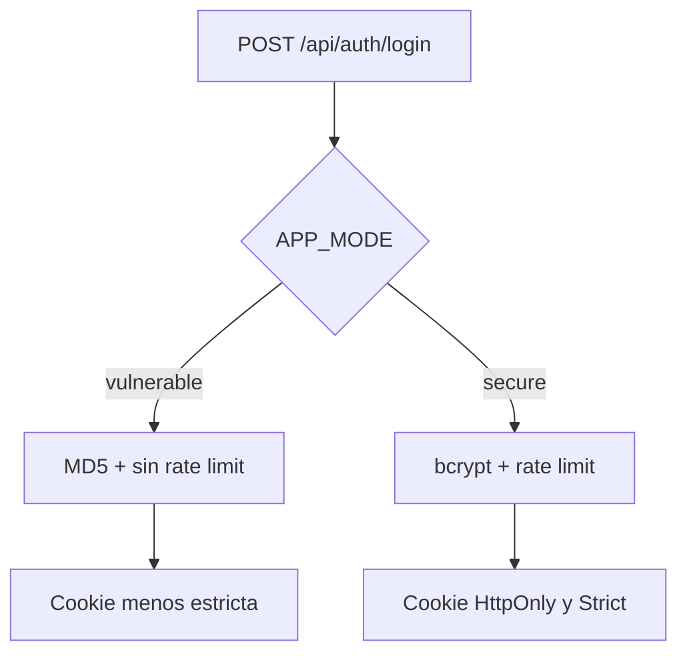

## 11. Flujo de datos, flujo de codigo y observabilidad

### 11.1 Flujo de datos extremo a extremo

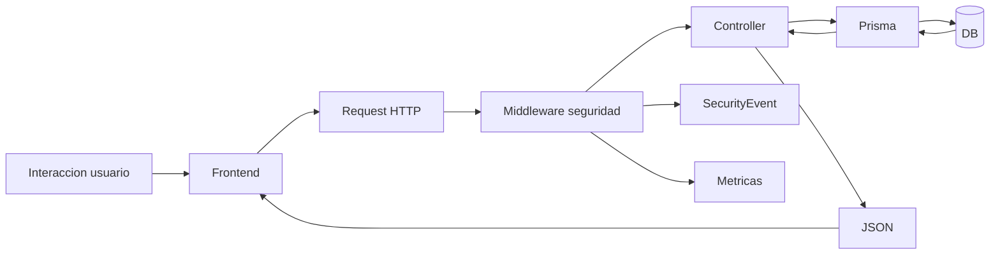

### 11.2 Flujo de codigo para login

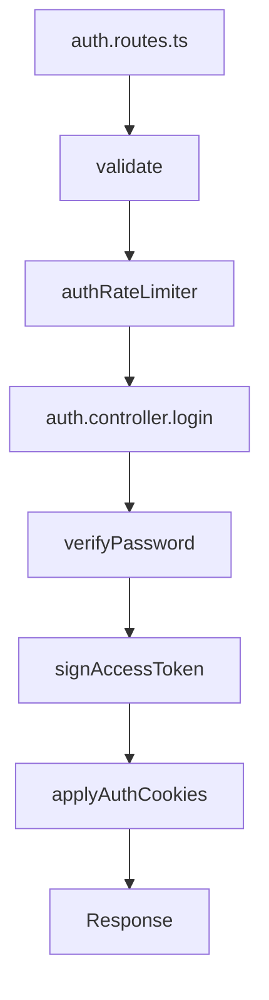

### 11.3 Flujo de codigo para deteccion de ataques

```mermaid
flowchart TD
    A[Request] --> B[attackDetection.ts]
    B --> C[detectAttackPatterns]
    C --> D{Coincide patron?}
    D -->|No| E[next()]
    D -->|Si| F[logSecurityEvent]
    F --> G{APP_MODE}
    G -->|vulnerable| H[console.warn + next()]
    G -->|secure| I[metrics + notifySoc + 403]
```

### 11.4 Observabilidad

La observabilidad se resuelve mediante:

- Winston para logs estructurados
- Prometheus para metricas
- SecurityEvent para persistencia de incidentes

## 12. Base de datos y modelo relacional

### 12.1 Entidades principales

- `User`
- `Service`
- `Ticket`
- `TicketMessage`
- `Payment`
- `SecurityEvent`

### 12.2 Relacion entre entidades

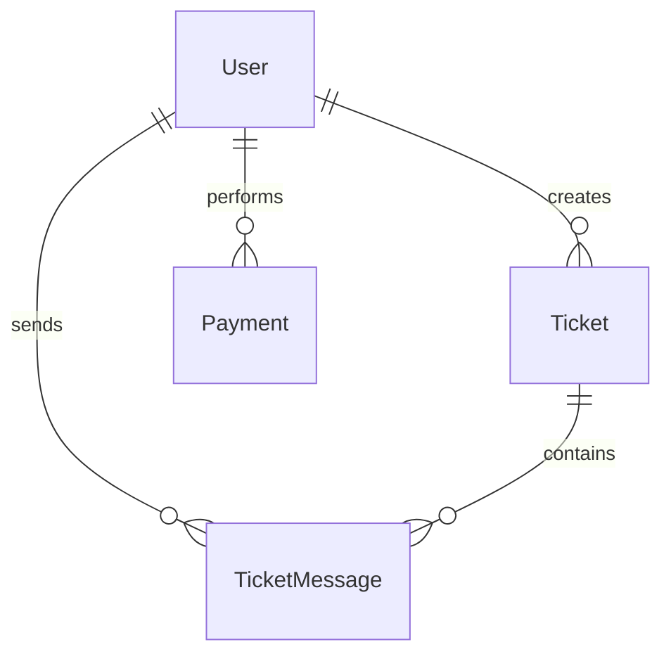

### 12.3 Justificacion del modelo

El modelo se ha mantenido intencionadamente simple para priorizar claridad pedagogica. No obstante, resulta suficientemente realista para representar:

- clientes y administradores
- catalogo comercial
- historico de pagos
- soporte tecnico
- incidentes de seguridad

## 13. Despliegue, contenedorizacion y puertos

### 13.1 Ejecucion local

- Frontend: `8000`
- Backend: `8001`

### 13.2 Ejecucion con Docker

Docker Compose levanta:

- `postgres` en `5432`
- `backend` en `8001`
- `prometheus` en `9090`

### 13.3 Diagrama de despliegue

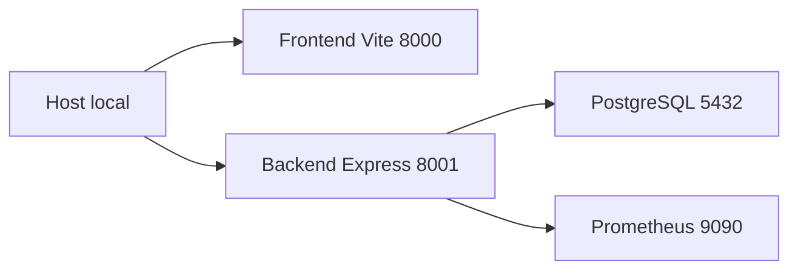

## 14. Pruebas realizadas

### 14.1 Pruebas tecnicas

1. Compilacion del frontend.
2. Compilacion del backend.
3. Generacion del cliente Prisma.
4. Verificacion del endpoint `/health`.
5. Scripts basicos para `test:vuln` y `test:secure`.

### 14.2 Objetivo de las pruebas

Validar:

- coherencia de arquitectura
- compatibilidad entre frontend y backend
- diferencia de comportamiento entre modos
- disponibilidad de metricas y eventos

## 15. Planificacion temporal y recursos

### 15.1 Planificacion por fases

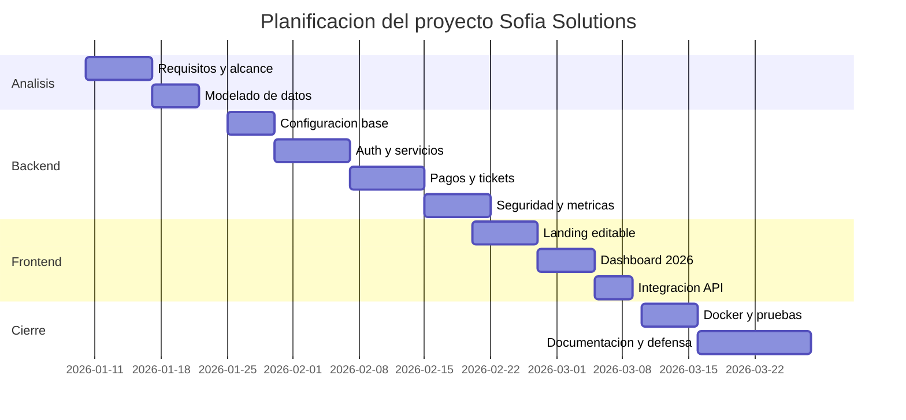

### 15.2 Recursos empleados

- equipo de desarrollo local
- Node.js
- PostgreSQL
- Docker Desktop
- editor de codigo
- navegador web

## 16. Presupuesto estimado

Aunque el proyecto se desarrolla en entorno academico, puede estimarse un presupuesto teorico:

| Concepto | Estimacion |
|---|---:|
| Analisis y disenio | 18 h |
| Desarrollo backend | 42 h |
| Desarrollo frontend | 24 h |
| Pruebas y validacion | 14 h |
| Documentacion | 20 h |
| Total horas | 118 h |

Si se valorase a 20 EUR/h:

**Coste estimado total:** 2.360 EUR

## 17. Resultados, conclusiones y trabajo futuro

### 17.1 Resultados

1. Se ha construido una solucion full stack coherente.
2. El frontend es editable y defendible en un contexto de presentacion.
3. El backend presenta una estructura modular y ampliable.
4. El modo dual permite demostrar seguridad de forma practica.
5. La documentacion sirve como base de memoria de proyecto final.

### 17.2 Conclusiones

La principal conclusion es que la seguridad no debe entenderse como un añadido final, sino como parte del diseno del sistema. El proyecto demuestra que una misma funcionalidad puede ser equivalente a nivel de negocio y, sin embargo, radicalmente distinta desde la perspectiva de riesgo. Tambien demuestra que observabilidad, logs, metricas y eventos de seguridad no son extras opcionales, sino componentes fundamentales para operar servicios modernos.

### 17.3 Trabajo futuro

1. Integrar 2FA real.
2. Implementar tests end-to-end con base de datos efimera.
3. Crear dashboards historicos.
4. Añadir WebSockets para eventos en tiempo real.
5. Integrar CI/CD y escaneo de dependencias.

## 18. Referencias

Express.js. (2024). *Express documentation*. https://expressjs.com/

NIST. (2020). *Security and privacy controls for information systems and organizations* (SP 800-53 Rev. 5). National Institute of Standards and Technology.

OWASP Foundation. (2021). *OWASP Top 10: The ten most critical web application security risks*. https://owasp.org/

Prisma. (2024). *Prisma ORM documentation*. https://www.prisma.io/docs/

Prometheus Authors. (2024). *Prometheus documentation*. https://prometheus.io/docs/

React. (2024). *React documentation*. https://react.dev/

Richardson, L., & Amundsen, M. (2013). *RESTful Web APIs*. O'Reilly Media.

Zod. (2024). *Zod documentation*. https://zod.dev/

## 19. Anexos

### Anexo A. Guion de defensa recomendado

1. Presentar el problema y la motivacion.
2. Explicar la arquitectura general.
3. Mostrar la landing y el panel 2026.
4. Enseñar el backend y sus modulos.
5. Comparar modo vulnerable y modo seguro.
6. Mostrar `/docs`, `/metrics` y eventos de seguridad.
7. Cerrar con conclusiones y mejoras futuras.

### Anexo B. Capturas sugeridas

1. Landing principal en `http://localhost:8000`
2. Panel principal en `http://localhost:8000/dashboard`
3. Swagger en `http://localhost:8001/docs`
4. Metricas en `http://localhost:8001/metrics`
5. Docker Compose levantado
6. Tabla `security_events` en PostgreSQL

### Anexo C. Evidencias recomendadas para la memoria

- captura del frontend
- captura del panel principal
- captura del health check
- captura del swagger
- captura del endpoint de metricas
- captura de logs
- captura de la tabla `payments`
- captura de la tabla `security_events`
