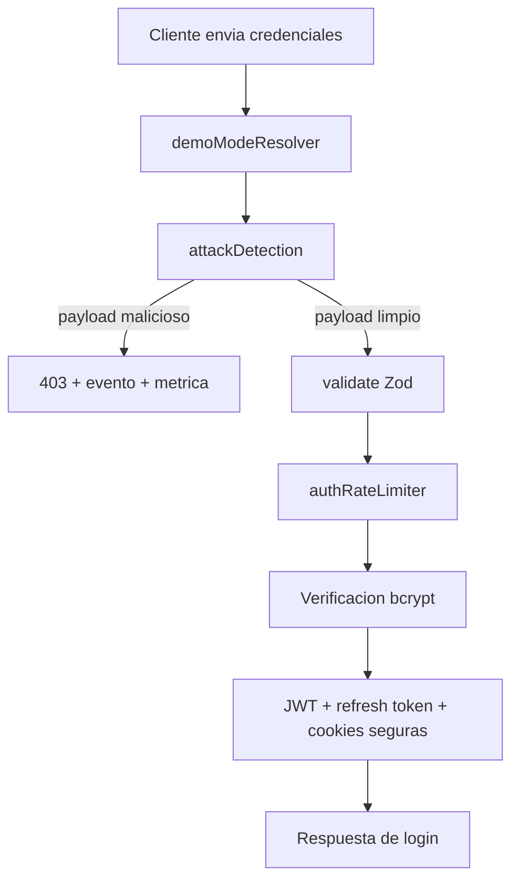
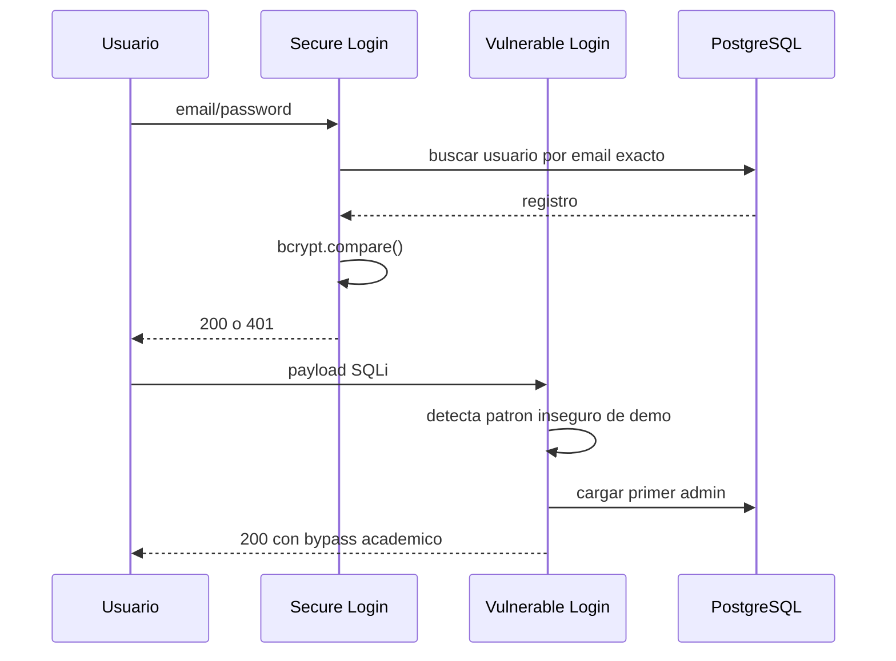

# Por que el login seguro ya no permite esos ataques

## Resumen

El login seguro bloquea los ataques por una combinacion de controles que actuan en distintas capas. No depende de una sola defensa.

## Vista de flujo

## 1. Resolucion de modo por peticion

El backend determina el modo mediante:

- ruta (`/secure` o `/vulnerable`)
- cabecera `x-demo-mode`
- valor por defecto `APP_MODE`

Esto permite que la misma API exponga dos comportamientos distintos de forma controlada y trazable.

## 2. Middleware de deteccion de ataques

En modo seguro, `attackDetection` analiza:

- `req.path`
- `req.query`
- `req.body`

Si detecta patrones de:

- SQL injection
- XSS
- path traversal

entonces:

1. registra el evento
2. incrementa metricas
3. notifica al SOC simulado
4. devuelve `403`

Por eso el payload no alcanza la logica de autenticacion.

### Que patrones se buscan

- expresiones tipicas de SQLi como `OR 1=1`, comentarios SQL o combinaciones con comillas
- etiquetas `<script>` y atributos `onerror` o `javascript:`
- secuencias `../` asociadas a path traversal

### Donde se registran

- log estructurado con Winston
- tabla `SecurityEvent`
- metrica `attacks_blocked_total`

## 3. Validacion estricta

El login seguro usa un esquema Zod mas estricto:

- `email` debe ser email valido
- `password` debe existir

Esto reduce la superficie de entrada malformada.

En concreto, el login seguro exige:

- email valido segun `z.string().email()`
- password presente
- formato JSON correcto

## 4. Rate limiting

En modo seguro se activa `express-rate-limit` sobre login.

Efecto:

- limita fuerza bruta
- reduce enumeracion de credenciales
- frena repeticion de payloads automatizados

En modo vulnerable este control se omite.

Esto es relevante porque evita que un atacante automatice:

- fuerza bruta de credenciales
- enumeracion de cuentas
- repeticion masiva del mismo payload para medir respuestas

## 5. Verificacion de credenciales robusta

El login seguro:

- compara contrasenas con `bcrypt`
- usa coste `12`
- no permite bypass por SQLi simulado

El vulnerable, en cambio, incorpora una via demostrativa donde un patron SQLi puede provocar autenticacion forzada.

## 5.1 Diferencia de flujo de credenciales

## 6. Cookies y sesion

El login seguro:

- genera `sessionId` aleatorio con `randomUUID`
- marca cookies como `HttpOnly`
- usa `SameSite=Strict`
- puede activar `Secure`

Esto reduce:

- robo por JavaScript
- fijacion de sesion
- reuso de identificadores predecibles

## 6.1 Comparativa directa

| Aspecto | Vulnerable | Seguro |
|---|---|---|
| Hash | MD5/demo laxo | bcrypt coste 12 |
| Rate limit | No efectivo | Activo |
| Deteccion SQLi/XSS | Solo registra | Bloquea |
| Cookie | Menos estricta | HttpOnly/SameSite/secure |
| Sesion | Sin rotacion fuerte | `randomUUID()` |
| Respuesta XSS | Puede reflejar HTML | No refleja HTML |

## 7. Reflexion XSS

En la demo vulnerable, un payload con `<script>` puede ser devuelto en `messageHtml` para mostrar reflexion insegura.

En la ruta segura eso no ocurre porque:

1. el middleware bloquea antes
2. la ruta segura no usa la rama vulnerable
3. la interfaz segura no interpreta HTML de la respuesta

## 8. Por que los scripts dejan de funcionar en secure

Los scripts no dejan de funcionar porque esten mal escritos. Siguen enviando la misma peticion; lo que cambia es la superficie expuesta por el backend.

### SQLi

- en vulnerable, el payload activa una rama intencional de bypass
- en secure, `attackDetection` lo clasifica como intento de inyeccion y devuelve `403`

### XSS

- en vulnerable, la respuesta puede incluir `messageHtml` y el frontend de demostracion lo renderiza
- en secure, el HTML no llega a renderizarse porque ni siquiera se genera en la API

### Path traversal

- en vulnerable, el request puede seguir su curso porque la deteccion es observacional
- en secure, la peticion se rechaza antes de tocar logica de negocio

### Manipulacion de pagos

- en vulnerable, el backend acepta el `amount` proporcionado por cliente
- en secure, el importe se recalcula contra la base de datos y se ignora el valor manipulado

## Conclusiones

El login seguro no deja de funcionar por "magia". Funciona porque varias capas trabajan juntas:

- deteccion temprana
- validacion
- control de frecuencia
- autenticacion robusta
- sesiones menos expuestas
- ausencia de ramas deliberadamente vulnerables

