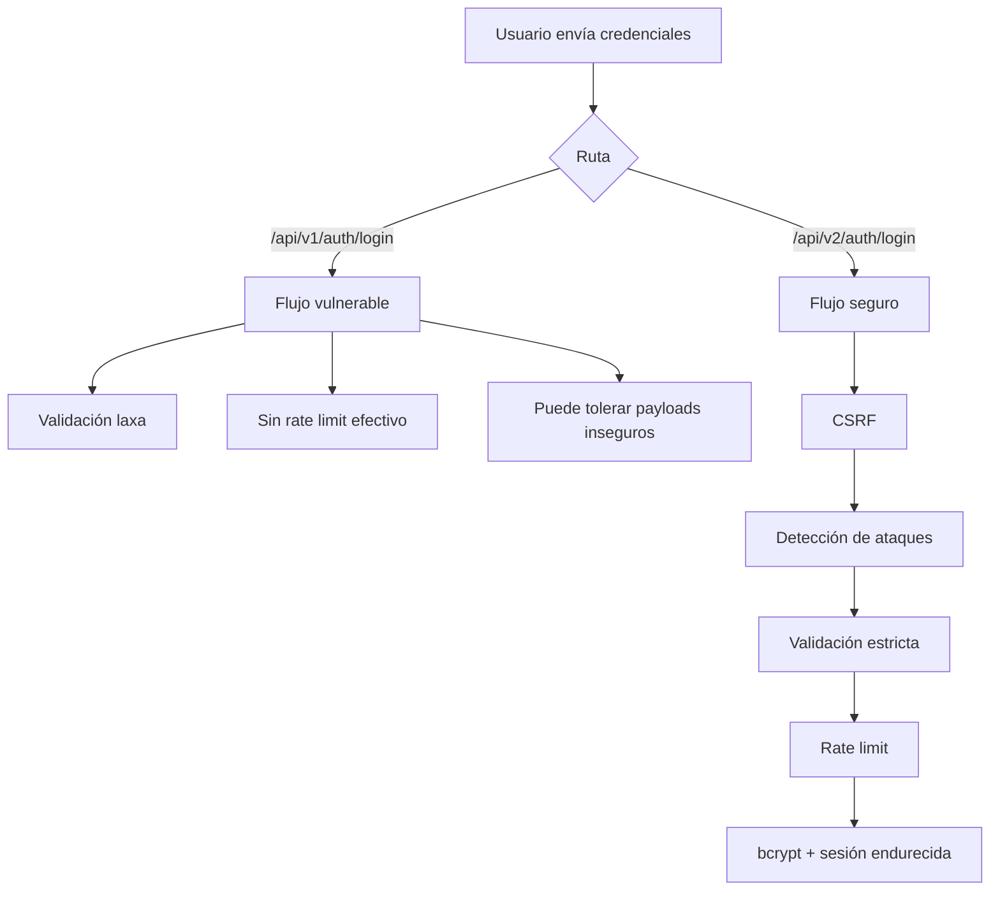

# Por qué el login seguro bloquea los ataques

## Resumen

El login seguro no depende de una única defensa. La robustez del sistema viene de la combinación de varias capas:

- validación de entrada;
- detección de patrones maliciosos;
- rate limiting;
- control de sesión;
- almacenamiento menos expuesto de tokens;
- trazabilidad.

El objetivo de este documento es explicar por qué el usuario ve una pantalla prácticamente igual, pero el comportamiento interno cambia de forma radical.

## Rutas comparadas

- login vulnerable: `http://localhost:8000/login`
- login seguro: `http://localhost:8000/login-secure`

Endpoints:

- vulnerable: `POST /api/v1/auth/login`
- seguro: `GET /api/v2/auth/csrf` y `POST /api/v2/auth/login`

## Flujo comparativo

## 1. CSRF en el login seguro

Antes del login seguro se obtiene un token CSRF:

- `GET /api/v2/auth/csrf`

Esto obliga a que el cliente siga el flujo previsto por el backend. No resuelve todos los riesgos, pero añade una capa realista de protección.

La versión vulnerable omite esta medida para facilitar la comparación.

## 2. Detección de ataques

El middleware de detección analiza:

- `req.body`
- `req.query`
- `req.path`

Busca patrones asociados a:

- SQL Injection;
- XSS;
- path traversal.

### Qué ocurre en modo seguro

1. Se detecta el patrón.
2. Se registra evidencia.
3. Se incrementa la métrica correspondiente.
4. La petición se bloquea con `403`.

### Qué ocurre en modo vulnerable

1. Se detecta el patrón.
2. Se deja pasar o se registra sin cortar el flujo.
3. La petición puede llegar a la lógica de negocio.

## 3. Validación más estricta

La versión segura exige una entrada con formato correcto y reduce el margen para valores arbitrarios.

Esto no sustituye al IDS, pero complementa la defensa:

- evita formatos inválidos;
- simplifica el comportamiento esperado;
- limita entradas ambiguas o manipuladas.

## 4. Rate limiting

La fuerza bruta y la automatización masiva dependen de repetir peticiones.

El login seguro limita intentos en una ventana temporal definida. Eso aporta:

- reducción del riesgo de brute force;
- menor exposición a credential stuffing;
- menos capacidad para automatizar pruebas ofensivas repetidas.

La versión vulnerable no aplica este control con el mismo rigor.

## 5. Verificación de credenciales

En el modo seguro:

- se usa hashing robusto;
- la comparación es más correcta desde el punto de vista defensivo;
- no existe la vía académica de bypass por patrón SQLi.

En el modo vulnerable:

- el comportamiento es deliberadamente más débil;
- se permite escenificar fallos para demostración.

## 6. Gestión de sesión y token

En el flujo seguro se endurece:

- el tratamiento de cookies;
- el manejo del token;
- el aislamiento frente a acceso desde scripts del cliente.

En el flujo vulnerable se deja una política más laxa para que el alumno pueda mostrar por qué esa decisión es un riesgo.

## 7. Registro y evidencia

El login seguro no solo bloquea. También deja rastro útil:

- logs estructurados;
- eventos de seguridad persistidos;
- métricas internas consumibles por Grafana;
- datos útiles para el monitor SOC.

Esto es importante para ASIX porque la defensa no termina al bloquear. También hay que:

- registrar;
- correlacionar;
- visualizar;
- explicar lo ocurrido.

## Tabla comparativa

| Dimensión | Vulnerable | Seguro |
|---|---|---|
| CSRF | No obligatorio | Obligatorio |
| Detección de payloads | Registra o tolera | Bloquea |
| Rate limit | Débil o ausente | Activo |
| Hashing | Más débil | Más robusto |
| Sesión | Menos endurecida | Más endurecida |
| Evidencia | Parcial | Completa |

## Conclusión

La clave del login seguro no es “verse diferente”, sino proteger el mismo flujo con controles adecuados. Esa es precisamente la idea que interesa defender en el proyecto: dos pantallas casi iguales pueden implicar dos niveles de riesgo completamente distintos.
